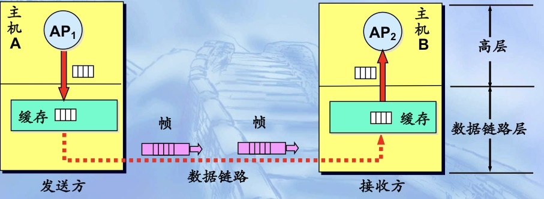
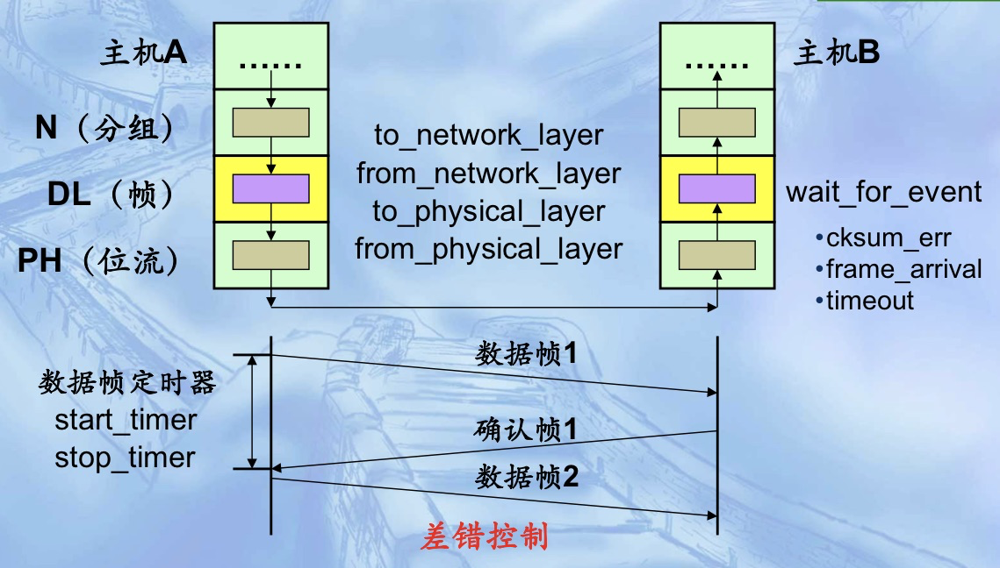
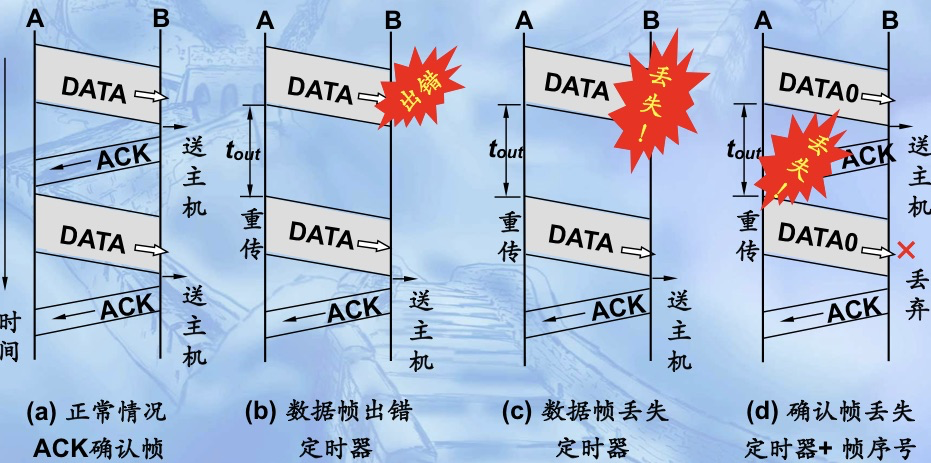
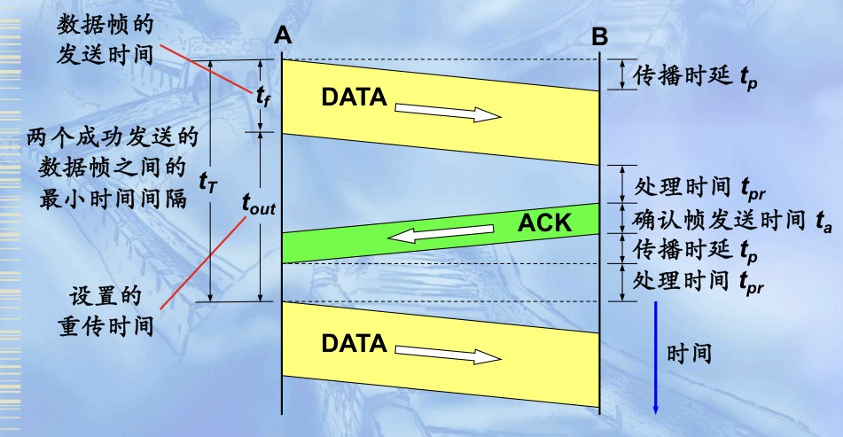

# 基本数据链路协议


## 约定

- 简化的通信模型：
  - 物理层、数据链路层、网络层都是独立的进程
  - 主机A用一个服务向主机B发送长数据流，且准备发送的数据是无限的
  - 主机不会崩溃
  - 硬件计算帧校验和

- 帧格式:

  | 帧类型 | 序号 | 确认号 | 高层数据(分组) |
  | ------ | ---- | ------ | -------------- |

  - 帧类型：数据帧data、肯定确认帧ack
  - 序号：当前发送的数据帧序号
  - 确认号：确认刚接收成功的数据帧序号

- 基本的函数设置：

## 协议1

- 假设：

  - 无差错控制：数据**不会出现差错**，也不会丢失

  - 无流量控住：无论发送方以多快的速率发送数据，**接收方总是来得及接收**

### sender

```cpp
void sender(void){
  frame s;
  packet buffer;
  while(true){
    from_network_layer(&buffer);	// get the data to be sent from network layer
    s.info = buffer;							
    to_physical_layer(&s);				// send frame to physical layer
  }
}
```

### recevier

```cpp
typedef enum{frame_arrival} event_type;
void recevier(void){
  frame r;
  event_type enent;
  while(true){
    wait_for_event(&event);			// wait for frame arrival
    from_physical_layer(&r);		// recieve the frame from physical layer
    to_network_layer(&r.info);	// process frame date and send to network layer
  }
}
```

## 协议2

- 假设：
  - 无差错控制：数据**不会出现差错**，也不会丢失
  - ~~无流量控住：无论发送方以多快的速率发送数据，**接收方总是来得及接收**~~
- Solution：最简单的流量控制，==停-等式的数据传输==

### sender

```cpp
typedef enum{frame_arrival} event_type;
void sender2(void){
  frame s;
  packet buffer;
	event_type enent;
  while(true){
    // same as protocol 1 
    from_network_layer(&buffer);	
    s.info = buffer;							
    to_physical_layer(&s);			
    // do not send next frame untill the sent frame arrive
     wait_for_event(&event);
  }
}
```

### reciever

```cpp
typedef enum{frame_arrival} event_type;
void recevier(void){
  frame s,r;
  event_type enent;
  while(true){
    // same as protocol 1
    wait_for_event(&event);			
    from_physical_layer(&r);	
    to_network_layer(&r.info);	
    // respond to the sender
    to_physical_layer(&s);
  }
}
```

## 协议3

- 假设：

  - ~~无差错控制：数据**不会出现差错**，也不会丢失~~
  - ~~无流量控住：无论发送方以多快的速率发送数据，**接收方总是来得及接收**~~

- Solution：==停-等式协议（ARQ协议）==

  - 肯定确认+定时器+帧序号

    - 超时定时器：
      - 主机每发送完一个数据帧都需要启动超时计时器，实现超时重发
      - 重传时间$t_{out}$一般**略大于从发送完数据帧到收到确认帧所需的平均时间**
        - $t_{out}=t_p+t_{pr}+t_a+t_p+t_{pr}\approx2t_p $

    - 帧编号：
      - 用于区分收到的数据帧是否重复，若重复则丢弃（但也要补发一个确认帧ack）
      - 对于停-等式协议，用于编号的序号字段只需要1bit(0/1)

### sender

```cpp
typedef enum{frame_arrival,cksum_err,timeout} event_type;
void sender2(void){
  seq_nr next_frame_to_send = 0;	// the index of the frame to be sent
  frame s;
  packet buffer;
	event_type enent;
  // get the frame before enter to the loop
  from_network_layer(&buffer);	
  while(true){
    s.info = buffer;				
    s.seq = next_frame_to_send;
    to_physical_layer(&s);
    start_timer(s.seq);
   	wait_for_event(&event);			// if timer > t_{out}, resend the frame
    if(event == frame_arrival){
      from_physical_layer(&s);	//get ack frame from physical layer
      if(s.ack == next_frame_to_send){
        stop_timer(s.ack);
        from_network_layer(&buffer);	// get next frame
        inc(next_frame_to_send);			// increase the frame sendding counter
      }
    }
  }
}
```

### receiver 

```cpp
typedef enum{frame_arrival,cksum_err,timeout} event_type;
void recevier(void){
  seq_nr frame_expected = 0;	// excepted index of upcoming frame
  frame e,r;
  event_type enent;
  while(true){
    wait_for_event(&event);			
    if(event == frame_arrival){
      from_physical_layer(&r);
      if(r.seq == frame_expected){
        to_network_layer(&r.info);		// send to network layer
        inc(frame_expected);			// increase the frame sendding counter
      }
      // s.ack == 0 if does not recieve the expected frame
      s.ack = 1 - frame_expected;
      to_physical_layer(&s);
    }
  }
}
```


# 滑动窗口协议