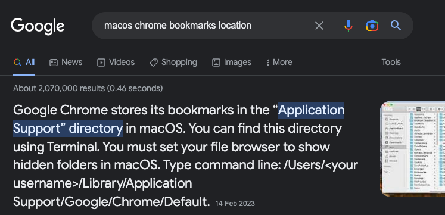
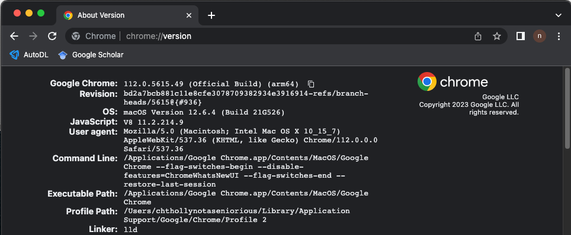
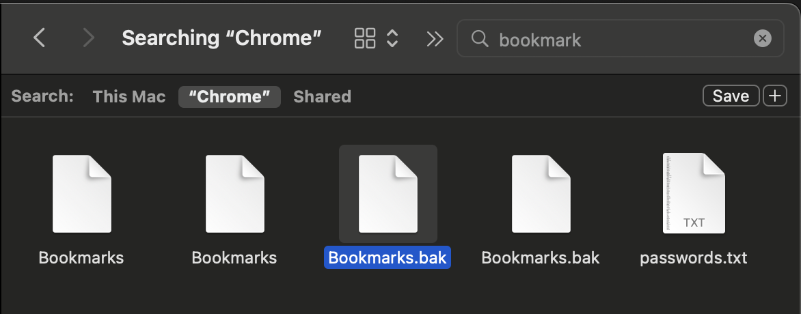

- find the bookmark document in chrome floder
- ==I can not find the floder according to this==

- a new reference: [recoverbook mark](https://recoverit.wondershare.com/mac-data-recovery/recover-bookmarks-chrome-mac.html)
  - input  chrome://version in chrome 
  - seems like the floder library is hidden
  - make the hidden floder visible 
  - Searching the bookmarks file
  - 将bookmarks.bak改名为bookmarks，不好用，没有解决问题
- 最后也没解决，气死我了，但是找到了一个访问chrome备份文件的方法，以后有其他用途可以看看
